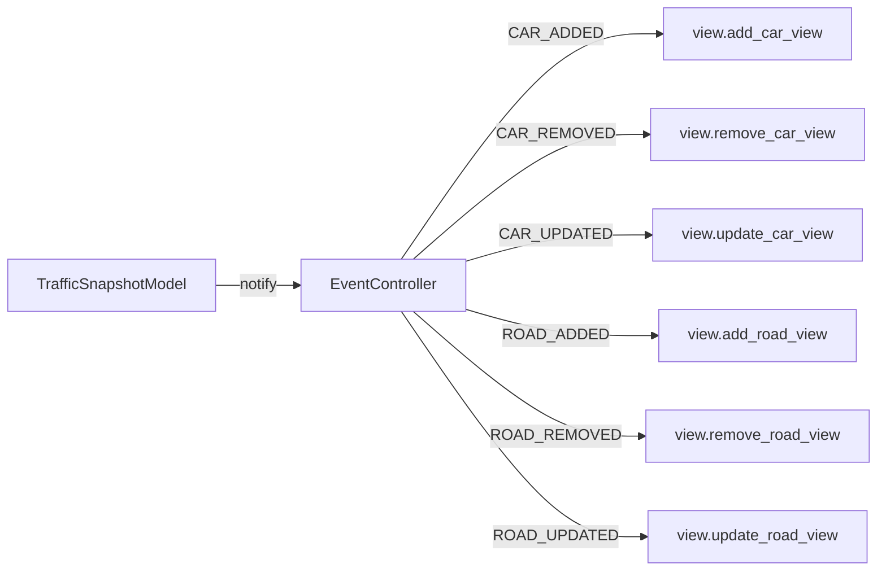
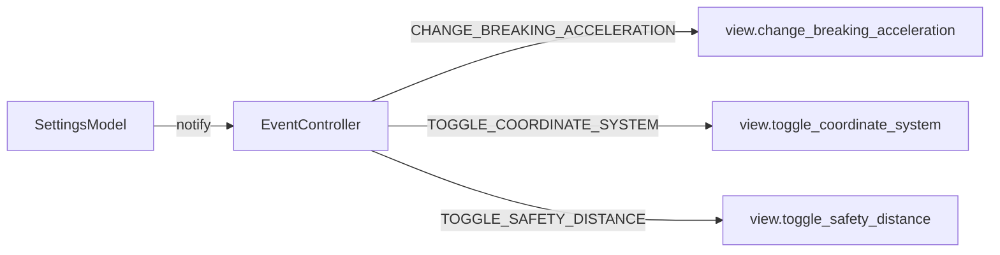
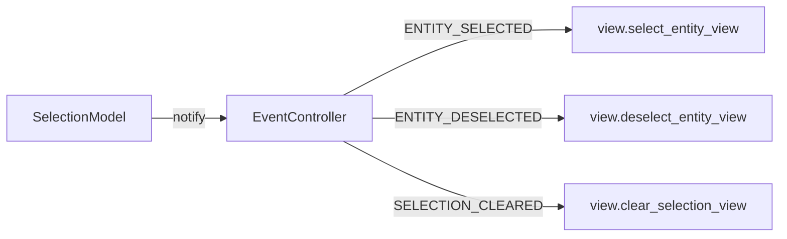

# UMLSL Traffic Editor - Architecture Documentation

> **Last Updated:** January 21, 2026

## Table of Contents

1. [Overview](#overview)
2. [High-Level Architecture](#high-level-architecture)
3. [Directory Structure](#directory-structure)
4. [Core Design Patterns](#core-design-patterns)
5. [Model Layer](#model-layer)
6. [Controller Layer](#controller-layer)
7. [View Layer](#view-layer)
8. [Command System](#command-system)
9. [Query System (UMLSL)](#query-system-umlsl)
10. [How the View Accesses the Model](#how-the-view-accesses-the-model)
11. [Event Flow](#event-flow)
12. [Implementation Status](#implementation-status)
13. [API Quick Reference](#api-quick-reference)

---

## Overview

The UMLSL Traffic Editor is a traffic simulation editor built using Python and PySide6. It allows users to:

- Create and edit traffic scenarios with roads, cars, and lanes
- Define and evaluate UMLSL (Urban Multi-Lane Spatial Logic) queries
- Visualize traffic simulation states

The application follows a **Model-View-Controller (MVC)** architecture with a **Command Pattern** for all mutations and
an **Observer Pattern** for model-to-view synchronization.

---

## High-Level Architecture

```
┌─────────────────────────────────────────────────────────────────────────────┐
│                                   VIEW                                       │
│  ┌─────────────────┐  ┌──────────────────┐  ┌────────────────────────────┐  │
│  │   MainWindow    │  │   TrafficScene   │  │   EntityListModel (Qt)     │  │
│  │   TrafficView   │  │   (QGraphics)    │  │   ViewEventHandlerImpl     │  │
│  └────────┬────────┘  └────────┬─────────┘  └──────────────┬─────────────┘  │
│           │                    │                           │                 │
│           └────────────────────┴───────────────────────────┘                 │
│                                    │                                         │
│                      Implements ViewEventHandler                             │
└────────────────────────────────────┼─────────────────────────────────────────┘
                                     │
                                     ▼
┌─────────────────────────────────────────────────────────────────────────────┐
│                              CONTROLLER                                      │
│  ┌───────────────────────────────────────────────────────────────────────┐  │
│  │                      ApplicationController                             │  │
│  │                              (Facade)                                  │  │
│  └───────────────────────────────────────────────────────────────────────┘  │
│           │                       │                        │                 │
│           ▼                       ▼                        ▼                 │
│  ┌─────────────────┐    ┌─────────────────┐     ┌─────────────────────┐     │
│  │ EventController │    │CommandController│     │   DataController    │     │
│  │ (Model→View     │    │ (Execute        │     │   (Read-only        │     │
│  │  sync via       │    │  Commands)      │     │    data access)     │     │
│  │  Observer)      │    │                 │     │                     │     │
│  └────────┬────────┘    └────────┬────────┘     └─────────────────────┘     │
│           │                      │                                           │
└───────────┼──────────────────────┼───────────────────────────────────────────┘
            │                      │
            │ Listens to           │ Uses
            │ (Observer Pattern)   │ (Command Pattern)
            ▼                      ▼
┌─────────────────────────────────────────────────────────────────────────────┐
│                                MODEL                                         │
│  ┌─────────────────────────────────────────────────────────────────────┐    │
│  │                          Domain Models                               │    │
│  │  ┌─────────────────────┐ ┌──────────────┐ ┌────────────────────┐   │    │
│  │  │TrafficSnapshotModel │ │SettingsModel │ │UMLSLQueriesModel   │   │    │
│  │  │(extends Observable) │ │(Observable)  │ │(Observable)        │   │    │
│  │  └─────────────────────┘ └──────────────┘ └────────────────────┘   │    │
│  │  ┌─────────────────────┐                                            │    │
│  │  │   SelectionModel    │                                            │    │
│  │  │   (Observable)      │                                            │    │
│  │  └─────────────────────┘                                            │    │
│  └─────────────────────────────────────────────────────────────────────┘    │
│                                                                              │
│  ┌─────────────────────────────────────────────────────────────────────┐    │
│  │                            Entities                                  │    │
│  │  ┌────────┐   ┌────────┐   ┌────────────┐   ┌────────────────┐     │    │
│  │  │  Car   │   │  Road  │   │ UMLSLQuery │   │ CrossingSegment│     │    │
│  │  └────────┘   └────────┘   └────────────┘   └────────────────┘     │    │
│  └─────────────────────────────────────────────────────────────────────┘    │
│                                                                              │
│  ┌─────────────────────────────────────────────────────────────────────┐    │
│  │                      Value Objects (Immutable)                       │    │
│  │  ┌──────┐ ┌──────────┐ ┌────────────┐ ┌─────────────┐ ┌──────────┐ │    │
│  │  │ Lane │ │ Position │ │ TurnIntent │ │ LaneSegment │ │  Path    │ │    │
│  │  └──────┘ └──────────┘ └────────────┘ └─────────────┘ └──────────┘ │    │
│  └─────────────────────────────────────────────────────────────────────┘    │
└──────────────────────────────────────────────────────────────────────────────┘
```

---

## Directory Structure

```
src/
├── ARCHITECTURE.md              # This documentation file
├── __init__.py
├── commands/                    # Command Pattern implementations
│   ├── command.py               # Base Command interface
│   ├── cars/                    # Car-related commands
│   │   ├── add_car.py
│   │   ├── delete_car.py
│   │   └── edit_car.py
│   ├── roads/                   # Road-related commands
│   │   ├── add_road.py
│   │   ├── delete_road.py
│   │   └── edit_road.py
│   ├── selection/               # Selection commands
│   │   ├── clear_selection.py
│   │   ├── deselect_car.py
│   │   ├── deselect_road.py
│   │   ├── select_car.py
│   │   └── select_road.py
│   ├── settings/                # Settings commands
│   │   ├── change_breaking_acceleration.py
│   │   ├── toggle_coordinate_system.py
│   │   └── toggle_safety_distance.py
│   ├── umlsl/                   # UMLSL query commands
│   │   ├── add_umlsl_query.py
│   │   ├── delete_umlsl_query.py
│   │   └── edit_umlsl_query.py
│   └── persistence/             # File I/O commands
│       ├── load_traffic_snapshot.py
│       ├── save_as_traffic_snapshot.py
│       └── save_traffic_snapshot.py
├── controllers/                 # MVC Controllers
│   ├── application_controller.py   # Facade controller
│   ├── command_controller.py       # Command execution API
│   ├── data_controller.py          # Read-only data access
│   ├── event_controller.py         # Model-View synchronization
│   └── view_event_contract.py      # ViewEventHandler interface
├── model/                       # Data layer
│   ├── domain_models/           # Observable domain models
│   │   ├── selection_model.py
│   │   ├── settings_model.py
│   │   ├── traffic_snapshot_model.py
│   │   ├── traffic_snapshot_reader.py    # Read interface
│   │   ├── traffic_snapshot_writer.py    # Write interface
│   │   └── umlsl_queries_model.py
│   ├── entities/                # Domain entities
│   │   ├── entity.py            # Base Entity class
│   │   ├── car.py
│   │   ├── road.py
│   │   └── umlsl_query.py
│   ├── helper/                  # Utility classes
│   │   ├── event_types.py       # Event type enums
│   │   ├── observables.py       # Observable, ObservableDict, ObservableList
│   │   └── uid_service.py       # UUID generation
│   ├── persistence/             # Serialization
│   │   └── persistence_service.py
│   └── traffic_value_objects/   # Immutable value objects
│       ├── lane.py
│       ├── position.py
│       ├── turn_intent.py
│       └── segments/
│           ├── segment.py
│           ├── lane_segment.py
│           └── crossing_segment.py
├── query/                       # UMLSL Query evaluation
│   ├── evaluator.py             # Query evaluation facade
│   ├── interval.py              # Interval arithmetic
│   ├── lexer.py                 # Tokenization
│   ├── view.py                  # View abstraction for queries
│   ├── visible_segments.py
│   └── ast/                     # Abstract Syntax Tree
│       ├── ast.py               # Base AST nodes
│       ├── ast_parser.py        # Token → AST conversion
│       ├── car_resolve.py
│       ├── chop_node.py
│       ├── claim_node.py
│       ├── crossing_node.py
│       ├── equality_node.py
│       ├── free_node.py
│       ├── logic_node.py
│       ├── quantor_node.py
│       ├── reserve_node.py
│       └── somewhere_node.py
└── view/                        # UI Layer
    ├── entity_list_model.py     # Qt List Model adapter
    ├── ui_utils.py
    ├── view_constants.py
    ├── view_event_handler_impl.py  # ViewEventHandler implementation
    ├── view_models.py
    ├── graphic_items/           # QGraphicsItem implementations
    │   └── road_item.py
    ├── testing/
    │   └── sample_scene_generator.py
    ├── ui/                      # Qt UI components
    │   ├── main_window.py
    │   └── traffic_canvas/
    └── widgets/                 # Qt Designer .ui files
        ├── main.ui
        ├── car_dialog.ui
        ├── road_dialog.ui
        ├── query_dialog.ui
        └── ...
```

---

## Core Design Patterns

### 1. Observer Pattern (Model-to-View Communication)

The model layer uses a custom **Observer Pattern** implementation (not PySide signals) to allow the backend to remain
framework-agnostic.

```python
# Base Observable class
class Observable:
    def attach(self, observer_callback: Callable) -> None: ...
    def detach(self, observer_callback: Callable) -> None: ...
    def notify(self, event_type: Enum, data=None) -> None: ...

# Observable collections
class ObservableDict(MutableMapping[Key, Value]): ...
class ObservableList(MutableSequence[T]): ...
```

**Event Types** are defined in `model/helper/event_types.py`:

```python
class TrafficSnapshotEventType(Enum):
    CAR_ADDED, CAR_REMOVED, CAR_UPDATED
    ROAD_ADDED, ROAD_REMOVED, ROAD_UPDATED
    CROSSING_SEGMENT_ADDED, CROSSING_SEGMENT_REMOVED, CROSSING_SEGMENT_UPDATED


class SettingsEventType(Enum):
    CHANGE_BREAKING_ACCELERATION
    TOGGLE_COORDINATE_SYSTEM
    TOGGLE_SAFETY_DISTANCE


class UMLSLQueriesEventType(Enum):
    UMLSL_QUERY_ADDED, UMLSL_QUERY_REMOVED, UMLSL_QUERY_UPDATED


class SelectionEventType(Enum):
    ENTITY_SELECTED, ENTITY_DESELECTED, SELECTION_CLEARED
```

### 2. Command Pattern (Mutations)

All model mutations go through **Command** objects:

```python
class Command(ABC, Generic[ReturnValue]):
    @abstractmethod
    def execute(self) -> ReturnValue: ...
```

Commands are stored in the `commands/` directory and organized by domain.

### 3. Interface Segregation (Reader/Writer)

The `TrafficSnapshotModel` implements two separate interfaces:

- **`TrafficSnapshotReader`**: Read-only access
- **`TrafficSnapshotWriter`**: Mutation access

This enforces separation of concerns and makes dependencies explicit.

---

## Model Layer

### Domain Models

| Model                  | Description                                    | Observable Events                                           |
|------------------------|------------------------------------------------|-------------------------------------------------------------|
| `TrafficSnapshotModel` | Central traffic state (roads, cars, crossings) | `CAR_*`, `ROAD_*`, `CROSSING_SEGMENT_*`                     |
| `SettingsModel`        | Application settings                           | `CHANGE_BREAKING_ACCELERATION`, `TOGGLE_*`                  |
| `SelectionModel`       | Currently selected entity                      | `ENTITY_SELECTED`, `ENTITY_DESELECTED`, `SELECTION_CLEARED` |
| `UMLSLQueriesModel`    | UMLSL queries                                  | `UMLSL_QUERY_*`                                             |

### Entities

| Entity       | Description             | Key Attributes                                                                              |
|--------------|-------------------------|---------------------------------------------------------------------------------------------|
| `Entity`     | Abstract base class     | `uid: str`                                                                                  |
| `Car`        | Vehicle in simulation   | `name`, `lane`, `position_on_lane`, `velocity`, `length`, `transition`, `next_turn`, `path` |
| `Road`       | Infinite lane container | `name`, `orientation`, `position`, `forward_lanes`, `backward_lanes`                        |
| `UMLSLQuery` | UMLSL query definition  | `latex`, `assigned_car_name`, `validation`                                                  |

### Value Objects (Immutable)

| Value Object      | Description                             |
|-------------------|-----------------------------------------|
| `Lane`            | Road reference + lane index + direction |
| `Position`        | 2D coordinate (x, y)                    |
| `TurnIntent`      | Turn direction + target lane info       |
| `Segment`         | Abstract path segment                   |
| `LaneSegment`     | Segment on a lane                       |
| `CrossingSegment` | Segment at intersection                 |
| `Path`            | List of segments                        |

### TrafficSnapshotReader Interface

```python
class TrafficSnapshotReader(ABC):
    def get_cars_on_road(self, road: Road) -> list[Car]: ...

    def get_cars(self) -> list[Car]: ...

    def get_roads(self) -> list[Road]: ...

    def get_cars_in_rectangle(self, x_min, y_min, x_max, y_max) -> list[Car]: ...

    def get_roads_in_rectangle(self, x_min, y_min, x_max, y_max) -> list[Road]: ...

    def get_max_velocity(self) -> float: ...

    def validate_lane(self, road, lane_index, lane_direction) -> bool: ...
```

### TrafficSnapshotWriter Interface

```python
class TrafficSnapshotWriter(ABC):
    def add_road(self, road: Road) -> None: ...

    def remove_road(self, road_name: str) -> None: ...

    def update_road(self, road_data: Road) -> None: ...

    def add_car(self, car: Car) -> None: ...

    def remove_car(self, car_name: str) -> None: ...

    def update_car(self, car_data: Car) -> None: ...
```

---

## Controller Layer

### ApplicationController (Facade)

Entry point for all controller operations:

```python
class ApplicationController:
    def __init__(self, traffic_snapshot, view, settings, umlsl_queries):
        self.event_controller = EventController(...)
        self.command_controller = CommandController(...)
        self.data_controller = DataController(...)

    def set_traffic_snapshot(self, traffic_snapshot): ...
```

### EventController (Model→View Sync)

Listens to model events and dispatches them to the view:

```python
class EventController:
    def __init__(self, view: ViewEventHandler, traffic_snapshot, settings, umlsl_queries, selection):
        self._setup_event_listeners()

    def _on_traffic_snapshot_event(self, event_type, data): ...

    def _on_settings_event(self, event_type, data): ...

    def _on_umlsl_query_event(self, event_type, data): ...

    def _on_selection_event(self, event_type, data): ...
```

### CommandController (Mutation API)

Provides high-level API for executing commands:

```python
class CommandController:
    # Car operations
    def add_car(self, name, assigned_road, lane_index, ...) -> bool: ...

    def remove_car(self, car_name) -> bool: ...

    def edit_car(self, car_name, **updates) -> bool: ...

    # Road operations
    def add_road(self, name, position, orientation, ...) -> bool: ...

    def remove_road(self, road_name) -> bool: ...

    def edit_road(self, road_name, **updates) -> bool: ...

    # UMLSL Query operations
    def add_umlsl_query(self, assigned_car_name, latex) -> bool: ...

    def remove_umlsl_query(self, query_id) -> bool: ...

    def edit_umlsl_query(self, query_id, **updates) -> bool: ...

    # Selection operations
    def select_car(self, car_name) -> None: ...

    def deselect_car(self, car_name) -> None: ...

    def select_road(self, road_name) -> None: ...

    def deselect_road(self, road_name) -> None: ...

    def clear_selection(self) -> None: ...

    # Settings operations
    def change_breaking_acceleration(self, value) -> None: ...

    def toggle_coordinate_system(self) -> None: ...

    def toggle_safety_distance(self) -> None: ...

    # Persistence
    def load_traffic_snapshot(self) -> None: ...

    def save_traffic_snapshot(self) -> None: ...

    def save_as_traffic_snapshot(self) -> None: ...
```

### DataController (Read-Only Access)

Provides data to the view without automatic updates:

```python
class DataController:
    def get_all_cars(self) -> list[Car]: ...
    def get_all_roads(self) -> list[Road]: ...
    def get_breaking_acceleration(self) -> float: ...
    def should_render_coordinate_system(self) -> bool: ...
    def should_render_safety_distance(self) -> bool: ...
```

---

## View Layer

### ViewEventHandler Contract

Views must implement this interface to receive model events:

```python
class ViewEventHandler(ABC):
    # Car events
    def add_car_view(self, car: Car) -> None: ...

    def remove_car_view(self, car: Car) -> None: ...

    def update_car_view(self, car: Car) -> None: ...

    # Road events
    def add_road_view(self, road: Road) -> None: ...

    def remove_road_view(self, road: Road) -> None: ...

    def update_road_view(self, road: Road) -> None: ...

    # Crossing segment events
    def add_crossing_segment_view(self, crossing_segment) -> None: ...

    def remove_crossing_segment_view(self, crossing_segment) -> None: ...

    def update_crossing_segment_view(self, crossing_segment) -> None: ...

    # Query events
    def add_query_view(self, query: UMLSLQuery) -> None: ...

    def remove_query_view(self, query: UMLSLQuery) -> None: ...

    def update_query_view(self, query: UMLSLQuery) -> None: ...

    # Settings events
    def change_breaking_acceleration(self, value: float) -> None: ...

    def toggle_coordinate_system(self, render: bool) -> None: ...

    def toggle_safety_distance(self, render: bool) -> None: ...

    # Selection events
    def select_entity_view(self, entity: Entity) -> None: ...

    def deselect_entity_view(self, entity: Entity) -> None: ...

    def clear_selection_view(self) -> None: ...
```

### EntityListModel (Qt Adapter)

Bridges domain entities to Qt's model/view framework:

```python
class EntityListModel(QAbstractListModel):
    EntityRole = Qt.UserRole + 1
    
    def rowCount(self, parent) -> int: ...
    def data(self, index, role) -> Any: ...
    def add_entity(self, entity: Entity) -> None: ...
    def remove_entity(self, entity: Entity) -> None: ...
    def update_entity(self, entity: Entity) -> None: ...
```

---

## Command System

### Command Base Class

```python
class Command(ABC, Generic[ReturnValue]):
    @abstractmethod
    def execute(self) -> ReturnValue: ...

class CommandValidationError(ValueError):
    """Exception raised when a command fails validation."""
```

### Command Structure Example

```python
class AddCarCommand(Command[None]):
    def __init__(
            self,
            traffic_snapshot_reader: TrafficSnapshotReader,
            traffic_snapshot_writer: TrafficSnapshotWriter,
            car_params: CarParams
    ): ...

    def execute(self) -> None:
        car = Car.from_params(self.car_params)
        self._traffic_snapshot_writer.add_car(car)
```

### Available Commands

| Category    | Command                      | Status            |
|-------------|------------------------------|-------------------|
| Cars        | `AddCarCommand`              | ⚠️ Prototype      |
| Cars        | `DeleteCarCommand`           | ❌ Not Implemented |
| Cars        | `EditCarCommand`             | ❌ Not Implemented |
| Roads       | `AddRoad`                    | ❌ Not Implemented |
| Roads       | `DeleteRoad`                 | ❌ Not Implemented |
| Roads       | `EditRoad`                   | ❌ Not Implemented |
| Selection   | `SelectCar`                  | ❌ Not Implemented |
| Selection   | `DeselectCar`                | ❌ Not Implemented |
| Selection   | `SelectRoad`                 | ❌ Not Implemented |
| Selection   | `DeselectRoad`               | ❌ Not Implemented |
| Selection   | `ClearSelection`             | ❌ Not Implemented |
| UMLSL       | `AddUMLSLQuery`              | ❌ Not Implemented |
| UMLSL       | `DeleteUMLSLQuery`           | ❌ Not Implemented |
| UMLSL       | `EditUMLSLQuery`             | ❌ Not Implemented |
| Settings    | `ChangeBreakingAcceleration` | ❌ Not Implemented |
| Settings    | `ToggleCoordinateSystem`     | ❌ Not Implemented |
| Settings    | `ToggleSafetyDistance`       | ❌ Not Implemented |
| Persistence | `LoadTrafficSnapshot`        | ❌ Not Implemented |
| Persistence | `SaveTrafficSnapshot`        | ❌ Not Implemented |
| Persistence | `SaveAsTrafficSnapshot`      | ❌ Not Implemented |

---

## Query System (UMLSL)

### Overview

The query system evaluates UMLSL (Urban Multi-Lane Spatial Logic) queries against the traffic snapshot.

### Components

```
┌─────────────┐     ┌─────────┐     ┌─────────────┐     ┌───────────────┐
│ LaTeX Query │ --> │  Lexer  │ --> │  ASTParser  │ --> │  ASTNode Tree │
└─────────────┘     └─────────┘     └─────────────┘     └───────┬───────┘
                                                                │
                                            ┌───────────────────┘
                                            ▼
                         ┌────────────────────────────────────┐
                         │       UMLSLEvaluator               │
                         │  evaluate_query(latex, car, accel) │
                         │          │                         │
                         │          ▼                         │
                         │    Compute Views                   │
                         │          │                         │
                         │          ▼                         │
                         │    AST.evaluate(snapshot, view)    │
                         └────────────────────────────────────┘
```

### Supported Token Types

```python
class TokenType(Enum):
    # Structural
    L_PAREN, R_PAREN, L_CURLY, R_CURLY, LESS_THAN, GREATER_THAN
    
    # UMLSL Operators
    H_CHOP = "\\hchop"      # Horizontal chop
    V_CHOP = "\\vchop"      # Vertical chop
    CLAIM = "\\cl"          # Claim predicate
    CROSSING = "\\cs"       # Crossing segment
    RESERVE = "\\re"        # Reserve predicate
    FREE = "\\free"         # Free predicate
    
    # Logic
    AND = "\\and"
    OR = "\\or"
    NEGATION = "\\neg"
    
    # Quantifiers
    EXISTS = "\\exists"
    FORALL = "\\forall"
    
    # Misc
    CAR_EQUALS = "="
    TRUE = "true"
    LITERAL = "LITERAL"
```

### AST Node Hierarchy

```
ASTNode (abstract)
├── AtomNode (precedence: ATOM)
│   ├── TrueNode
│   ├── ClaimNode
│   ├── ReserveNode
│   ├── FreeNode
│   ├── CrossingSegmentNode
│   └── EqualityCarNode
├── UnaryNode (precedence: UNARY)
│   ├── NegationNode
│   ├── ExistsNode
│   └── SomewhereNode (TODO)
└── BinaryNode
    ├── ChopNode (precedence: BINARY_CHOP)
    │   ├── HorizontalChopNode
    │   └── VerticalChopNode
    ├── ConjunctionNode (precedence: BINARY_CONJUNCTION)
    └── DisjunctionNode (precedence: BINARY_DISJUNCTION)
```

### Usage

```python
evaluator = UMLSLEvaluator(traffic_snapshot)
result = evaluator.evaluate_query(
    latex_string="\\cl(C_1) \\and \\free",
    car=ego_car,
    braking_accel=5.0
)  # Returns bool
```

---

## How the View Accesses the Model

### Reactive Updates (Push Model)

The view receives **automatic updates** when the model changes:

1. Model changes (e.g., `traffic_snapshot.add_car(car)`)
2. `TrafficSnapshotModel` notifies observers via `notify(CAR_ADDED, car)`
3. `EventController._on_traffic_snapshot_event()` receives the event
4. `EventController` calls `view.add_car_view(car)`
5. View updates its UI

```python
# In EventController
def _on_traffic_snapshot_event(self, event_type, data):
    if event_type == TrafficSnapshotEventType.CAR_ADDED:
        self._view.add_car_view(data)
    elif event_type == TrafficSnapshotEventType.CAR_REMOVED:
        self._view.remove_car_view(data)
    # ... etc
```

### On-Demand Data (Pull Model)

For data that doesn't need reactivity, use `DataController`:

```python
# In View code
cars = data_controller.get_all_cars()
roads = data_controller.get_all_roads()
```

### View → Model Mutations

The view **NEVER** modifies the model directly. All mutations go through `CommandController`:

```python
# ✅ Correct: Use CommandController
command_controller.add_car(name="Car1", assigned_road=road, ...)

# ❌ Wrong: Direct model access
traffic_snapshot.add_car(car)  # Don't do this from the view!
```

### Complete Flow Example

```
┌─────────────────────────────────────────────────────────────────────────────┐
│                              User Action                                     │
│                         "Create New Car" button                              │
└─────────────────────────────────────────────────────────────────────────────┘
                                     │
                                     ▼
┌─────────────────────────────────────────────────────────────────────────────┐
│                                 VIEW                                         │
│  CarDialog collects user input → calls command_controller.add_car(...)      │
└─────────────────────────────────────────────────────────────────────────────┘
                                     │
                                     ▼
┌─────────────────────────────────────────────────────────────────────────────┐
│                          COMMAND CONTROLLER                                  │
│  Creates AddCarCommand → executes command                                   │
└─────────────────────────────────────────────────────────────────────────────┘
                                     │
                                     ▼
┌─────────────────────────────────────────────────────────────────────────────┐
│                              COMMAND                                         │
│  AddCarCommand.execute() → traffic_snapshot_writer.add_car(car)             │
└─────────────────────────────────────────────────────────────────────────────┘
                                     │
                                     ▼
┌─────────────────────────────────────────────────────────────────────────────┐
│                    TRAFFIC SNAPSHOT MODEL                                    │
│  _cars[car.uid] = car → notify(CAR_ADDED, car)                              │
└─────────────────────────────────────────────────────────────────────────────┘
                                     │
                                     ▼
┌─────────────────────────────────────────────────────────────────────────────┐
│                          EVENT CONTROLLER                                    │
│  _on_traffic_snapshot_event(CAR_ADDED, car) → view.add_car_view(car)        │
└─────────────────────────────────────────────────────────────────────────────┘
                                     │
                                     ▼
┌─────────────────────────────────────────────────────────────────────────────┐
│                                 VIEW                                         │
│  ViewEventHandlerImpl.add_car_view(car) → Updates UI (list, canvas, etc.)   │
└─────────────────────────────────────────────────────────────────────────────┘
```

---

## Event Flow

### TrafficSnapshot Events



### Settings Events



### Selection Events



---

## Implementation Status

### ✅ Implemented

| Component                       | Status     | Notes                                            |
|---------------------------------|------------|--------------------------------------------------|
| Observable Pattern              | ✅ Complete | `Observable`, `ObservableDict`, `ObservableList` |
| Event Types                     | ✅ Complete | All event enums defined                          |
| Entity Base Classes             | ✅ Complete | `Entity`, `Car`, `Road`, `UMLSLQuery`            |
| Value Objects                   | ✅ Complete | `Lane`, `Position`, `TurnIntent`, `Segment`      |
| TrafficSnapshotReader Interface | ✅ Complete | Interface defined                                |
| TrafficSnapshotWriter Interface | ✅ Complete | Interface defined                                |
| ViewEventHandler Interface      | ✅ Complete | All methods defined                              |
| EventController                 | ✅ Complete | Event routing implemented                        |
| UMLSL Lexer                     | ✅ Complete | Tokenization working                             |
| UMLSL AST Parser                | ✅ Complete | All node types implemented                       |
| UMLSL Evaluator                 | ⚠️ Partial | Basic evaluation works, view computation TODO    |

### ⚠️ Partially Implemented (Prototypes)

| Component              | Status       | What's Missing                                          |
|------------------------|--------------|---------------------------------------------------------|
| `TrafficSnapshotModel` | ⚠️ Skeleton  | All methods are stubs (`pass`)                          |
| `DataController`       | ⚠️ Skeleton  | All methods raise `NotImplementedError`                 |
| `CommandController`    | ⚠️ Skeleton  | High-level API defined, all raise `NotImplementedError` |
| `AddCarCommand`        | ⚠️ Prototype | Error handling missing                                  |
| `ViewEventHandlerImpl` | ⚠️ Partial   | Many methods are empty `pass`                           |

### ❌ Not Implemented

| Component                                  | What Needs to Be Done                                                  |
|--------------------------------------------|------------------------------------------------------------------------|
| **TrafficSnapshotModel Methods**           | Implement `get_cars()`, `get_roads()`, `add_car()`, `add_road()`, etc. |
| **DataController Methods**                 | Implement `get_all_cars()`, `get_all_roads()`, etc.                    |
| **All Command execute()**                  | Implement actual logic in all command files                            |
| **Undo/Redo System**                       | `CommandController._command_history` is commented out                  |
| **PersistenceService**                     | `serialize()` and `deserialize()` not implemented                      |
| **CrossingSegment.get_position()**         | Not implemented                                                        |
| **UMLSLEvaluator._compute_views()**        | Multi-view computation (Fig 6 in paper) TODO                           |
| **TrafficSnapshotModel.to_dict/from_dict** | Serialization not implemented                                          |
| **TrafficSnapshotModel.to_json/from_json** | JSON serialization not implemented                                     |
| **UMLSLQueriesModel.to_json/from_json**    | JSON serialization not implemented                                     |
| **Validation in TrafficSnapshotWriter**    | `TrafficSnapshotValidationError` defined but not used                  |

### Priority Implementation Order

1. **TrafficSnapshotModel methods** - Required for everything else
2. **Command execute() methods** - Enables all user interactions
3. **DataController methods** - Enables view data population
4. **PersistenceService** - Enables save/load
5. **Undo/Redo** - Nice to have

---

## API Quick Reference

### For View Developers

#### Get Data (Pull)

```python
# Through DataController
cars = data_controller.get_all_cars()
roads = data_controller.get_all_roads()
```

#### Receive Updates (Push)

```python
# Implement ViewEventHandler in your view class
class MyView(ViewEventHandler):
    def add_car_view(self, car: Car) -> None:
        # Handle new car added to model
        pass
```

#### Trigger Mutations

```python
# Through CommandController - ALWAYS use this for changes
command_controller.add_car(
    name="Car1",
    assigned_road=road,
    lane_index=0,
    lane_direction=LaneDirection.FORWARD,
    color="#FF0000",
    position_on_lane=50.0,
    transition=0.0,
    velocity=10.0,
    length=4.0,
    next_turn=None
)

command_controller.select_entity("Car1")
command_controller.clear_selection()
```

### For Model Developers

#### Create Observable Model

```python
class MyModel(Observable):
    def __init__(self):
        super().__init__()

    def update_something(self, value):
        self._data = value
        self.notify(MyEventType.SOMETHING_UPDATED, value)
```

#### Create Command

```python
class MyCommand(Command[bool]):
    def __init__(self, reader: TrafficSnapshotReader, writer: TrafficSnapshotWriter, params):
        self._reader = reader
        self._writer = writer
        self._params = params

    def execute(self) -> bool:
        # 1. Validate using reader
        # 2. Mutate using writer
        # 3. Return success/failure
        return True
```

---

## Glossary

| Term                | Definition                                                       |
|---------------------|------------------------------------------------------------------|
| **Entity**          | Domain object with identity (`uid`), e.g., Car, Road, UMLSLQuery |
| **Value Object**    | Immutable data object without identity, e.g., Lane, Position     |
| **Observable**      | Object that notifies observers of state changes                  |
| **Command**         | Encapsulated mutation operation                                  |
| **TrafficSnapshot** | Complete state of the traffic simulation                         |
| **View**            | UMLSL concept: spatial region from a car's perspective           |
| **Lane**            | Logical lane on a road (road + index + direction)                |
| **Transition**      | Car's lateral position during lane change (-1.0 to 1.0)          |
| **UMLSL**           | Urban Multi-Lane Spatial Logic                                   |

---

## Contact & Contributing

For questions about the architecture or to contribute, please contact the development team.
